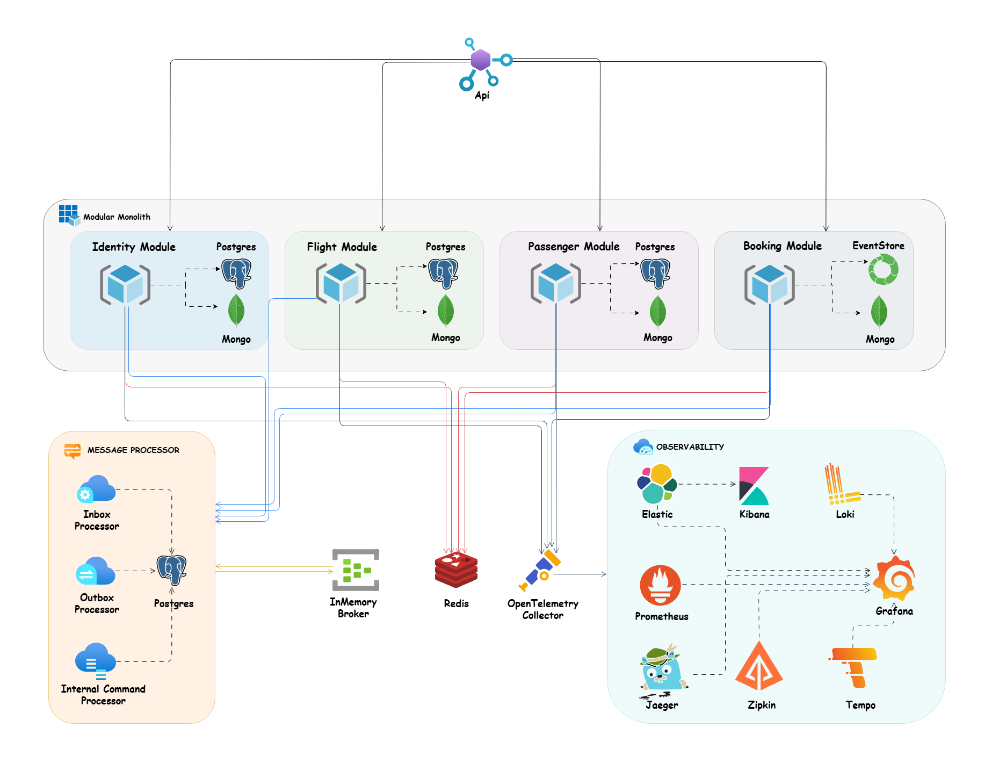

# 🪁 Modular Monolith Architecture Style

> In **Modular Monolith Architecture**, the application is divided into modules, each responsible for a specific functionality. However, the entire application is still deployed as a single unit.

# Table of Contents

- [Key Features](#key-features)
- [When to Use](#when-to-use)
- [Challenges](#challenges)
- [Modular Monolith Architecture Design](#modular-monolith-architecture-design)
- [Development Setup](#development-setup)
    - [Dotnet Tools Packages](#dotnet-tools-packages)
    - [Husky](#husky)
    - [Upgrade Nuget Packages](#upgrade-nuget-packages)
- [How to Run](#how-to-run)
  - [Docker Compose](#docker-compose)
  - [Build](#build)
  - [Run](#run)
  - [Test](#test)
- [Documentation Apis](#documentation-apis)


## Key Features
1. **Modular Design**: The application is divided into modules, each responsible for a specific functionality.
2. **Loose Coupling**: Modules interact through well-defined interfaces, improving maintainability.
3. **Single Deployment**: The entire application is still deployed as one unit.
4. **Shared Database**: Typically uses a single database, but modules can have their own schemas or tables.


## When to Use
1. **Medium to Large Projects**: Suitable for applications with growing complexity but not ready for microservices.
2. **Better Maintainability**: Ideal for teams wanting a more organized and maintainable codebase than a traditional monolith.
3. **Future-Proofing**: A stepping stone toward microservices, allowing teams to prepare for future scalability.
4. **Single Team or Small Teams**: Works well for teams that want modularity without the overhead of distributed systems.


## Challenges
- Still a single deployment unit, so scaling is limited.
- Requires careful design to avoid tight coupling between modules.
- Not as scalable or fault-tolerant as microservices.


## Modular Monolith Architecture Design




## Development Setup

### Dotnet Tools Packages
For installing our requirement packages with .NET cli tools, we need to install `dotnet tool manifest`.
```bash
dotnet new tool-manifest
```
And after that we can restore our dotnet tools packages with .NET cli tools from `.config` folder and `dotnet-tools.json` file.
```
dotnet tool restore
```

### Husky
Here we use `husky` to handel some pre commit rules and we used `conventional commits` rules and `formatting` as pre commit rules, here in [package.json](.././package.json). of course, we can add more rules for pre commit in future. (find more about husky in the [documentation](https://typicode.github.io/husky/get-started.html))
We need to install `husky` package for `manage` `pre commits hooks` and also I add two packages `@commitlint/cli` and `@commitlint/config-conventional` for handling conventional commits rules in [package.json](.././package.json).
Run the command bellow in the root of project to install all npm dependencies related to husky:

```bash
npm install
```

> Note: In the root of project we have `.husky` folder and it has `commit-msg` file for handling conventional commits rules with provide user friendly message and `pre-commit` file that we can run our `scripts` as a `pre-commit` hooks. that here we call `format` script from [package.json](./package.json) for formatting purpose.

### Upgrade Nuget Packages
For upgrading our nuget packages to last version, we use the great package [dotnet-outdated](https://github.com/dotnet-outdated/dotnet-outdated).
Run the command below in the root of project to upgrade all of packages to last version:
```bash
dotnet outdated -u
```

## How to Run

> ### Docker Compose

To run this app in `Docker`, use the [docker-compose.yaml](./deployments/docker-compose/docker-compose.yaml) and execute the below command at the `root` of the application:

```bash
docker-compose -f ./deployments/docker-compose/docker-compose.yaml up -d
```

> ### Build
To `build` all modules, run this command in the `root` of the project:
```bash
dotnet build
```

> ### Run
To `run` all modules, run this command in the root of the `Api` folder where the `csproj` file is located:
```bash
dotnet run
```

> ### Test

To `test` all modules, run this command in the `root` of the project:
```bash
dotnet test
```

> ### Documentation Apis

Each microservice provides `API documentation` and navigate to `/swagger` for `Swagger OpenAPI` or `/scalar/v1` for `Scalar OpenAPI` to visit list of endpoints.

As part of API testing, I created the [booking.rest](./booking.rest) file which can be run with the [REST Client](https://github.com/Huachao/vscode-restclient) `VSCode plugin`.
