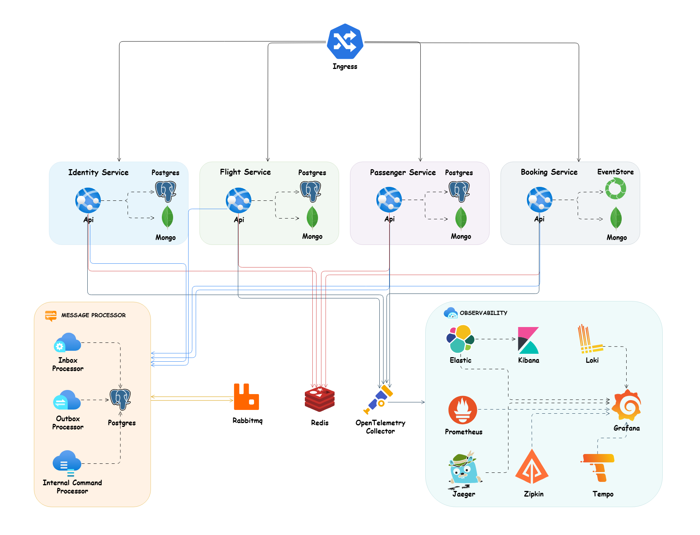

# 🪁 Microservices Architecture Style

> In **Microservices Architecture**, the application is broken down into small, independent services, each responsible for a specific business capability. Each service can be developed, deployed, and scaled independently.

# Table of Contents

- [Key Features](#key-features)
- [When to Use](#when-to-use)
- [Challenges](#challenges)
- [Microservices Architecture Design](#microservices-architecture-design)
- [Development Setup](#development-setup)
    - [Dotnet Tools Packages](#dotnet-tools-packages)
    - [Husky](#husky)
    - [Upgrade Nuget Packages](#upgrade-nuget-packages)
- [How to Run](#how-to-run)
  - [Config Certificate](#config-certificate)
  - [Docker Compose](#docker-compose)
  - [Kubernetes](#kubernetes)
  - [Build](#build)
  - [Run](#run)
  - [Test](#test)
- [Documentation Apis](#documentation-apis)


## Key Features
1. **Independent Services**: Each service is a separate project with its own database and deployment pipeline, enabling independent development and deployment.
2. **Decentralized Communication**: Services communicate via APIs (REST, gRPC) or message brokers (RabbitMQ, Kafka), ensuring loose coupling and resilience.
3. **Scalability**: Services can be scaled independently based on demand, allowing efficient resource utilization.
4. **Fault Tolerance**: Failures are isolated, preventing cascading failures and ensuring high availability.
5. **Technology Agnostic**: Services can use different technologies, frameworks, or databases, providing flexibility.


## When to Use
1. **Large and Complex Projects**: Ideal for applications with complex business logic that can be broken into smaller, manageable services.
2. **High Scalability Needs**: Suitable for applications requiring independent scaling of components.
3. **Fault Tolerance and High Availability**: Perfect for systems where failure isolation and uptime are critical.
4. **Distributed Teams**: Enables teams to work independently on different services.
5. **Frequent Updates**: Supports continuous deployment and A/B testing for individual services.
6. **Technology Diversity**: Allows the use of different technologies for different services.


## Challenges
- Increased complexity in management, DevOps overhead, data consistency, latency, and higher costs.


## Microservices Architecture Design




## Development Setup

### Dotnet Tools Packages
For installing our requirement packages with .NET cli tools, we need to install `dotnet tool manifest`.
```bash
dotnet new tool-manifest
```
And after that we can restore our dotnet tools packages with .NET cli tools from `.config` folder and `dotnet-tools.json` file.
```
dotnet tool restore
```

### Husky
Here we use `husky` to handel some pre commit rules and we used `conventional commits` rules and `formatting` as pre commit rules, here in [package.json](.././package.json). of course, we can add more rules for pre commit in future. (find more about husky in the [documentation](https://typicode.github.io/husky/get-started.html))
We need to install `husky` package for `manage` `pre commits hooks` and also I add two packages `@commitlint/cli` and `@commitlint/config-conventional` for handling conventional commits rules in [package.json](.././package.json).
Run the command bellow in the root of project to install all npm dependencies related to husky:

```bash
npm install
```

> Note: In the root of project we have `.husky` folder and it has `commit-msg` file for handling conventional commits rules with provide user friendly message and `pre-commit` file that we can run our `scripts` as a `pre-commit` hooks. that here we call `format` script from [package.json](./package.json) for formatting purpose.

### Upgrade Nuget Packages
For upgrading our nuget packages to last version, we use the great package [dotnet-outdated](https://github.com/dotnet-outdated/dotnet-outdated).
Run the command below in the root of project to upgrade all of packages to last version:
```bash
dotnet outdated -u
```

## How to Run

> ### Config Certificate
Run the following commands to [Config SSL](https://docs.microsoft.com/en-us/aspnet/core/security/docker-compose-https?view=aspnetcore-6.0) in your system:

#### Windows using Linux containers
```bash
dotnet dev-certs https -ep %USERPROFILE%\.aspnet\https\aspnetapp.pfx -p password
dotnet dev-certs https --trust
```
***Note:** for running this command in `powershell` use `$env:USERPROFILE` instead of `%USERPROFILE%`*

#### macOS or Linux
```bash
dotnet dev-certs https -ep ${HOME}/.aspnet/https/aspnetapp.pfx -p $CREDENTIAL_PLACEHOLDER$
dotnet dev-certs https --trust
```
> ### Docker Compose


To run this app in `Docker`, use the [docker-compose.yaml](./deployments/docker-compose/docker-compose.yaml) and execute the below command at the `root` of the application:

```bash
docker-compose -f ./deployments/docker-compose/docker-compose.yaml up -d
```

> ### Kubernetes
To `configure TLS` in the `Kubernetes cluster`, we need to install `cert-manager` based on the [docs](https://cert-manager.io/docs/installation) and run the following commands to apply TLS in our application. Here, we use [Let's Encrypt](https://letsencrypt.org/) to encrypt our certificate.

```bash
kubectl apply -f ./deployments/kubernetes/booking-cert-manager.yml
```

To apply all necessary `deployments`, `pods`, `services`, `ingress`, and `config maps`, please run the following command:

```bash
kubectl apply -f ./deployments/kubernetes/booking-microservices.yml
```

> ### Build
To `build` all microservices, run this command in the `root` of the project:
```bash
dotnet build
```

> ### Run
To `run` each microservice, run this command in the root of the `Api` folder of each microservice where the `csproj` file is located:
```bash
dotnet run
```

> ### Test

To `test` all microservices, run this command in the `root` of the project:
```bash
dotnet test
```

> ### Documentation Apis

Each microservice provides `API documentation` and navigate to `/swagger` for `Swagger OpenAPI` or `/scalar/v1` for `Scalar OpenAPI` to visit list of endpoints.

As part of API testing, I created the [booking.rest](./booking.rest) file which can be run with the [REST Client](https://github.com/Huachao/vscode-restclient) `VSCode plugin`.
