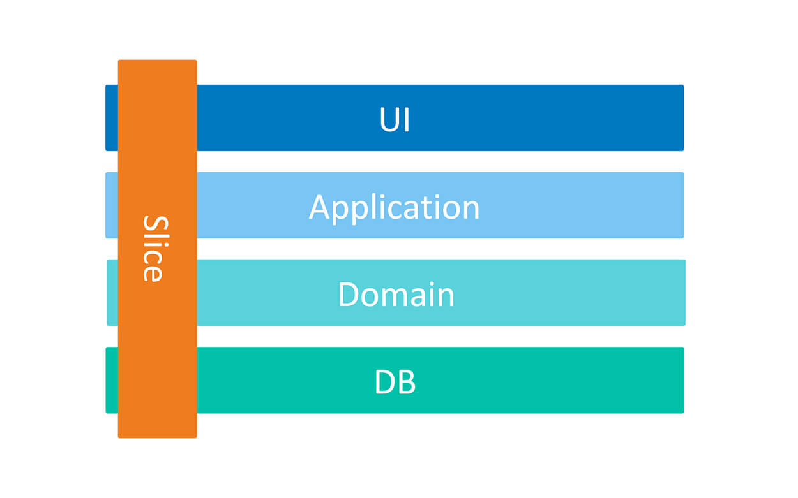

[](https://opensource.org/licenses/MIT)
# Booking-Microservices-Sample

Booking Microservices is a Sample application for booking ticket. This application based on different software architecture and technologies like .Net Core, CQRS, DDD, Vertical Slice Architecture, Docker, kubernetes, tye, masstransit, RabbitMQ, Grpc, yarp reverse proxy, Identity Server, Redis, SqlServer, Entity Framework Core, Event Sourcing and different level of testing.


🌀 Keep in mind this repository is work in progress and will be complete over time 🚀

# Table of Contents

- [The Goals of This Project](#the-goals-of-this-project)
- [Plan](#plan)
- [Technologies - Libraries](#technologies---libraries)
- [The Domain and Bounded Context - Service Boundary](#the-domain-and-bounded-context---service-boundary)
- [Structure of Project](#structure-of-project)
- [Prerequisites](#prerequisites)
- [How to Run](#how-to-run)
  - [Docker Compose](#docker-compose)
  - [Kubernetes](#kubernetes)
- [Support](#support)
- [Contribution](#contribution)

## The Goals of This Project

- The microservices base on `Domain Driven Design (DDD)` implementation.
- Correct `separation of bounded contexts` for each microservice.
- Communications between bounded contexts through asynchronous `MessageBus` and `events`.
- Simple `CQRS` implementation and event driven architecture.
- Using `Best Practice` and `New Technologies` and `Design Patterns`.
- Using `Docker-Compose` and `Kubernetes` for our deployment mechanism.
- Implementing various type of testing like `Unit Testing`, `Integration Testing`.

## Plan
> This project is in progress, New features will be added over time.

I will try to register some [Issues](https://github.com/meysamhadeli/booking-microservices-sample/issues) for my `TODO` works, just to not forget and also for tracking my works in future.

High-level plan is represented in the table

| Feature | Status |
| ------- | ------ |
| API Gateway | Completed ✔️ |
| Identity Service | Completed ✔️ |
| Flight Service | Completed ✔️ |
| Passenger Service | Completed ✔️ |
| Booking Service |  Completed ✔️ |
| Building Blocks |  In Progress 👷‍♂️ |


## Technologies - Libraries
- ✔️ **[`.NET 6`](https://dotnet.microsoft.com/download)** - .NET Framework and .NET Core, including ASP.NET and ASP.NET Core
- ✔️ **[`MVC Versioning API`](https://github.com/microsoft/aspnet-api-versioning)** - Set of libraries which add service API versioning to ASP.NET Web API, OData with ASP.NET Web API, and ASP.NET Core
- ✔️ **[`EF Core`](https://github.com/dotnet/efcore)** - Modern object-database mapper for .NET. It supports LINQ queries, change tracking, updates, and schema migrations
- ✔️ **[`Masstransit`](https://github.com/MassTransit/MassTransit)** - Distributed Application Framework for .NET.
- ✔️ **[`MediatR`]()** - Simple, unambitious mediator implementation in .NET.
- ✔️ **[`FluentValidation`](https://github.com/FluentValidation/FluentValidation)** - Popular .NET validation library for building strongly-typed validation rules
- ✔️ **[`Swagger & Swagger UI`](https://github.com/domaindrivendev/Swashbuckle.AspNetCore)** - Swagger tools for documenting API's built on ASP.NET Core
- ✔️ **[`Serilog`](https://github.com/serilog/serilog)** - Simple .NET logging with fully-structured events
- ✔️ **[`Polly`](https://github.com/App-vNext/Polly)** - Polly is a .NET resilience and transient-fault-handling library that allows developers to express policies such as Retry, Circuit Breaker, Timeout, Bulkhead Isolation, and Fallback in a fluent and thread-safe manner
- ✔️ **[`Scrutor`](https://github.com/khellang/Scrutor)** - Assembly scanning and decoration extensions for Microsoft.Extensions.DependencyInjection
- ✔️ **[`Opentelemetry-dotnet`](https://github.com/open-telemetry/opentelemetry-dotnet)** - The OpenTelemetry .NET Client
- ✔️ **[`DuendeSoftware IdentityServer`](https://github.com/DuendeSoftware/IdentityServer)** - The most flexible and standards-compliant OpenID Connect and OAuth 2.x framework for ASP.NET Core
- ✔️ **[`EasyCaching`](https://github.com/dotnetcore/EasyCaching)** - Open source caching library that contains basic usages and some advanced usages of caching which can help us to handle caching more easier.
- ✔️ **[`Mapster`](https://github.com/MapsterMapper/Mapster)** - Convention-based object-object mapper in .NET.
- ✔️ **[`Hellang.Middleware.ProblemDetails`](https://github.com/khellang/Middleware/tree/master/src/ProblemDetails)** - A middleware for handling exception in .Net Core
- ✔️ **[`IdGen`](https://github.com/RobThree/IdGen)** - Twitter Snowflake-alike ID generator for .Net
- ✔️ **[`Yarp`](https://github.com/microsoft/reverse-proxy)** - Reverse proxy toolkit for building fast proxy servers in .NET
- ✔️ **[`Tye`](https://github.com/dotnet/tye)** - Developer tool that makes developing, testing, and deploying microservices and distributed applications easier
- ✔️ **[`MagicOnion`](https://github.com/Cysharp/MagicOnion)** - gRPC based HTTP/2 RPC Streaming Framework for .NET, .NET Core and Unity.
- ✔️ **[`EventStore`](https://github.com/EventStore/EventStore)** - The open-source, functional database with Complex Event Processing.
- ✔️ **[`MongoDB.Driver`](https://github.com/mongodb/mongo-csharp-driver)** - .NET Driver for MongoDB.
- ✔️ **[`xUnit.net`](https://github.com/xunit/xunit)** - A free, open source, community-focused unit testing tool for the .NET Framework.
- ✔️ **[`Respawn`](https://github.com/jbogard/Respawn)** - Respawn is a small utility to help in resetting test databases to a clean state.

## The Domain And Bounded Context - Service Boundary

- `Identity Service`: The Identity Service is a bounded context for authenticate and authorize users through with [Identity Server](https://github.com/DuendeSoftware/IdentityServer). Also, this service is responsible for creating users and their corresponding roles and permission with using [.Net Core Identity](https://docs.microsoft.com/en-us/aspnet/core/security/authentication/identity) and Jwt authentication and authorization.

- `Flight Service`: The Flight Service is a bounded context for all operation related to flight and get available filght and seat.

- `Passenger Service`: The Passenger Service is a bounded context for managing our passengers information, track the activities and subscribing to get notification for out of stock products

- `Booking Service`: The Booking Service is a bounded context for managing all operation related to booking ticket.


## Structure of Project

I used [yarp reverse proxy](https://microsoft.github.io/reverse-proxy/articles/index.html) for routes synchronous and asynchronous request to the corresponding microservice. and each microservices has own business and dependencies such as databases, files and etc. and each microservices is decuple from other microservices and develop and deploy separately. and these microservices talk to each other with synchronous call like Rest or gRpc and use RabbitMq or Kafka for asynchronous call.

We have separate microservice ([IdentityServer](https://github.com/DuendeSoftware/IdentityServer)) for authentication and authorization and each request go to API Gateway and then route to Identity microservices and after authentication and authorization back API Gateway and then route to expected microservices.

Also here I used [RabbitMQ](https://github.com/rabbitmq) as my MessageBroker for async communication between the microservices with using eventually consistency mechanism. and top of that I use [MassTransit](https://github.com/MassTransit/MassTransit) provides many requirements in microservice projects such as messaging, availability, reliability and etc. 

Microservices are `event based` which means they can publish and/or subscribe to any events occurring in the setup. By using this approach for communicating between services, each microservice does not need to know about the other services or handle errors occurred in other microservices.

Also I used a [mediator pattern](https://dotnetcoretutorials.com/2019/04/30/the-mediator-pattern-in-net-core-part-1-whats-a-mediator/) with using [MediatR](https://github.com/jbogard/MediatR) library in my controllers for a clean and [thin controller](https://codeopinion.com/thin-controllers-cqrs-mediatr/), also instead of using a `application service` class because after some times our controller will depends to different services and this breaks single responsibility principle. We use mediator pattern to manage the delivery of messages to handlers. One of the advantages behind the [mediator pattern](https://lostechies.com/jimmybogard/2014/09/09/tackling-cross-cutting-concerns-with-a-mediator-pipeline/) is that it allows the application code to define a pipeline of activities for requests . For example in our controllers we create a command and send it to mediator and mediator will route our command to a specific command handler in application layer.

To support [Single Responsibility Principle](https://en.wikipedia.org/wiki/Single_responsibility_principle) and [Don't Repeat Yourself principles](https://en.wikipedia.org/wiki/Don%27t_repeat_yourself), the implementation of cross-cutting concerns is done using the mediatr [pipeline behaviors](https://github.com/jbogard/MediatR/wiki/Behaviors) or creating a [mediatr decorators](https://lostechies.com/jimmybogard/2014/09/09/tackling-cross-cutting-concerns-with-a-mediator-pipeline/).

Also in this project I used mix of [clean architecture](https://jasontaylor.dev/clean-architecture-getting-started/) and [vertical slice architecture](https://jimmybogard.com/vertical-slice-architecture/) and also I used [feature folder structure](http://www.kamilgrzybek.com/design/feature-folders/) in this project.

Also here I used cqrs for decompose my features to very small parts that make our application

- maximize performance, scalability and simplicity.
- adding new feature to this mechanism is very easy without any breaking change in other part of our codes. New features only add code, we're not changing shared code and worrying about side effects.
- easy to maintain and any changes only affect on one command or query and avoid any breaking changes on other parts
- it gives us better separation of concerns and cross cutting concern (with help of mediatr behavior pipelines) in our code instead of a big service class for doing a lot of things.

I treat each request as a distinct use case or slice, encapsulating and grouping all concerns from front-end to back.
When adding or changing a feature in an application in n-tire architecture, we are typically touching many different "layers" in an application. we are changing the user interface, adding fields to models, modifying validation, and so on. Instead of coupling across a layer, we couple vertically along a slice. we `Minimize coupling` `between slices`, and `maximize coupling` `in a slice`.

With this approach, each of our vertical slices can decide for itself how to best fulfill the request. New features only add code, we're not changing shared code and worrying about side effects.



With using CQRS pattern, we cut each business functionality into some vertical slices, and inner each of this slices we have [technical folders structure](http://www.kamilgrzybek.com/design/feature-folders) specific to that feature (command, handlers, infrastructure, repository, controllers, ...). In Our CQRS pattern each command/query handler is a separate slice. This is where you can reduce coupling between layers. Each handler can be a separated code unit, even copy/pasted. Thanks to that, we can tune down the specific method to not follow general conventions (e.g. use custom SQL query or even different storage). In a traditional layered architecture, when we change the core generic mechanism in one layer, it can impact all methods.


## How to Run

### Config Certificate

Runt the following commands for [Config SSL](microsoft.com/en-us/aspnet/core/security/docker-compose-https?view=aspnetcore-6.0) in your system
``` bash
dotnet dev-certs https -ep %USERPROFILE%\.aspnet\https\aspnetapp.pfx -p {password here}
dotnet dev-certs https --trust
```
>Note: for running this command in `powershell` use `$env:USERPROFILE` instead of `%USERPROFILE%`

### Docker Compose

Run this app on docker with this [docker-compose.yaml](./deployments/docker-compose/docker-compose.yaml) file with bellow command in root of application:

``` bash
docker-compose -f ./deployments/docker-compose/docker-compose.yaml up -d
```

### Documentation Apis

For testing apis I used [REST Client](https://github.com/Huachao/vscode-restclient) plugin of VSCode and this file [booking.rest](./booking.rest) is in root of project.
Also after running api you have access to swagger open api for all microservices in /swagger route path.

# Support
If you like my work, feel free to:

- ⭐ this repository. And we will be happy together :)


Thanks a bunch for supporting me!

## Contribution

Contributions are always welcome! Please take a look at the [contribution guidelines](https://github.com/meysamhadeli/booking-microservices-sample/blob/master/contributing.md) pages first.

Thanks to all [contributors](https://github.com/meysamhadeli/booking-microservices-sample/graphs/contributors), you're awesome and wouldn't be possible without you! The goal is to build a categorized community-driven collection of very well-known resources.

## Project Refrences & Credits
- [https://github.com/jbogard/ContosoUniversityDotNetCore-Pages](https://github.com/jbogard/ContosoUniversityDotNetCore-Pages)
- [https://github.com/kgrzybek/modular-monolith-with-ddd](https://github.com/kgrzybek/modular-monolith-with-ddd)
- [https://github.com/oskardudycz/EventSourcing.NetCore](https://github.com/oskardudycz/EventSourcing.NetCore)
- [https://github.com/thangchung/clean-architecture-dotnet](https://github.com/thangchung/clean-architecture-dotnet)
- [https://github.com/jasontaylordev/CleanArchitecture](https://github.com/jasontaylordev/CleanArchitecture)
- [https://github.com/pdevito3/MessageBusTestingInMemHarness](https://github.com/pdevito3/MessageBusTestingInMemHarness)
- [https://github.com/devmentors/FeedR](https://github.com/devmentors/FeedR)
