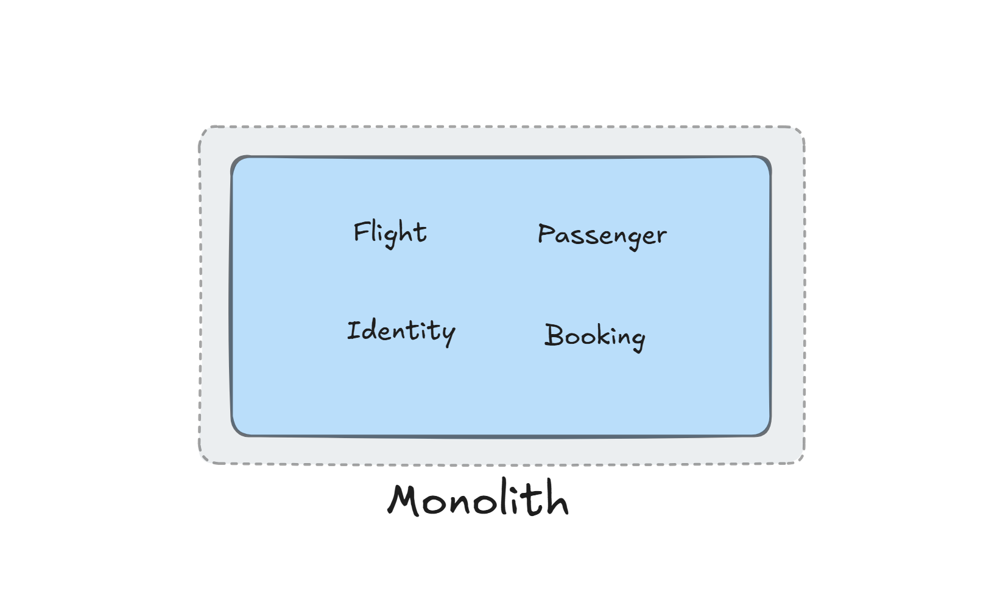
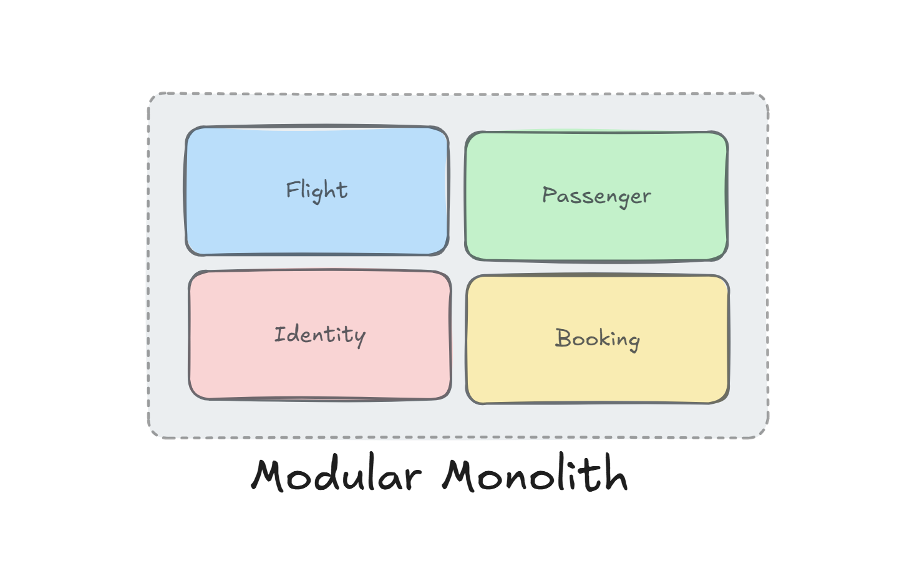
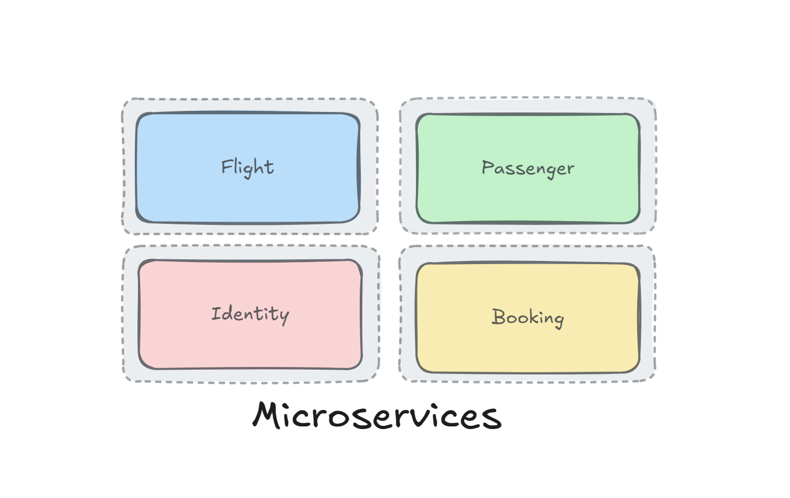

# 🪁 Legacy To Modern Architecture Styles

    

           
                 
    

> **A practical architecture styles for migrating from legacy monolith to modern cloud native application with the latest technologies and architectures like Vertical Slice Architecture, Event Sourcing, CQRS, DDD, gRpc, MongoDB, RabbitMq, and Masstransit in .Net 9.**

  

  

# Table of Contents

- [The Goals of This Project](#the-goals-of-this-project)
- [Technologies - Libraries](#technologies---libraries)
- [Architectural Styles and How to Choose the Right One](#architectural-styles-and-how-to-choose-the-right-one)
  - [1. Monolithic Architecture](#1-monolithic-architecture-style)
  - [2. Modular Monolith Architecture](#2-modular-monolith-architecture-style)
  - [3. Microservices Architecture](#3-microservices-architecture-style)
- [The Domain and Bounded Context - Service Boundary](#the-domain-and-bounded-context---service-boundary)
- [Structure of Project](#structure-of-project)
- [Support](#support)
- [Contribution](#contribution)

## The Goals of This Project

- :sparkle: Using `Vertical Slice Architecture` for `architecture` level.
- :sparkle: Using `Domain Driven Design (DDD)` to implement all `business logic`.
- :sparkle: Using `Rabbitmq` on top of `Masstransit` for `Event Driven Architecture`.
- :sparkle: Using `gRPC` for `internal communication`.
- :sparkle: Using `CQRS` implementation with `MediatR` library.
- :sparkle: Using `Postgres` for `write side` database.
- :sparkle: Using `MongoDB` for `read side` database.
- :sparkle: Using `Event Store` for `write side` of Booking Microservice/Module to store all `historical change` of aggregate.
- :sparkle: Using `Inbox Pattern` for ensuring message idempotency for receiver and `Exactly once Delivery`.
- :sparkle: Using `Outbox Pattern` for ensuring no message is lost and there is at `At Least One Delivery`.
- :sparkle: Using `Unit Testing` for testing small units and mocking our dependencies with `Nsubstitute`.
- :sparkle: Using `End-To-End Testing` and `Integration Testing` for testing `features` with all dependencies using `testcontainers`.
- :sparkle: Using `Fluent Validation` and a `Validation Pipeline Behaviour` on top of `MediatR`.
- :sparkle: Using `Minimal API` for all endpoints.
- :sparkle: Using `AspNetCore OpenApi` for `generating` built-in support `OpenAPI documentation` in ASP.NET Core.
- :sparkle: Using `Health Check` for `reporting` the `health` of app infrastructure components.
- :sparkle: Using `Docker-Compose` and `Kubernetes` for our deployment mechanism.
- :sparkle: Using `Kibana` on top of `Serilog` for `logging`.
- :sparkle: Using `OpenTelemetry` for distributed tracing on top of `Jaeger`.
- :sparkle: Using `OpenTelemetry` for monitoring on top of `Prometheus` and `Grafana`.
- :sparkle: Using `IdentityServer` for authentication and authorization base on `OpenID-Connect` and `OAuth2`.
- :sparkle: Using `Yarp` as a microservices `gateway`.
- :sparkle: Using `Kubernetes` to achieve efficient `scaling` and ensure `high availability` for each of our microservices.
- :sparkle: Using `Nginx Ingress Controller` for `load balancing` between our microservices top of `Kubernetes`.
- :sparkle: Using `cert-manager` to Configure `TLS` in `kubernetes cluster`.

## Technologies - Libraries

- ✔️ **[`.NET 9`](https://github.com/dotnet/aspnetcore)** - .NET Framework and .NET Core, including ASP.NET and ASP.NET Core.
- ✔️ **[`MVC Versioning API`](https://github.com/microsoft/aspnet-api-versioning)** - Set of libraries which add service API versioning to ASP.NET Web API, OData with ASP.NET Web API, and ASP.NET Core.
- ✔️ **[`EF Core`](https://github.com/dotnet/efcore)** - Modern object-database mapper for .NET. It supports LINQ queries, change tracking, updates, and schema migrations.
- ✔️ **[`AspNetCore OpenApi`](https://learn.microsoft.com/en-us/aspnet/core/fundamentals/openapi/aspnetcore-openapi?view=aspnetcore-9.0&tabs=visual-studio#configure-openapi-document-generation)** - Provides built-in support for OpenAPI document generation in ASP.NET Core.
- ✔️ **[`Masstransit`](https://github.com/MassTransit/MassTransit)** - Distributed Application Framework for .NET.
- ✔️ **[`MediatR`](https://github.com/jbogard/MediatR)** - Simple, unambitious mediator implementation in .NET.
- ✔️ **[`FluentValidation`](https://github.com/FluentValidation/FluentValidation)** - Popular .NET validation library for building strongly-typed validation rules.
- ✔️ **[`Scalar`](https://github.com/scalar/scalar/tree/main/packages/scalar.aspnetcore)** - Scalar provides an easy way to render beautiful API references based on OpenAPI/Swagger documents.
- ✔️ **[`Swagger UI`](https://github.com/domaindrivendev/Swashbuckle.AspNetCore)** - Swagger tools for documenting API's built on ASP.NET Core.
- ✔️ **[`Serilog`](https://github.com/serilog/serilog)** - Simple .NET logging with fully-structured events
- ✔️ **[`Polly`](https://github.com/App-vNext/Polly)** - Polly is a .NET resilience and transient-fault-handling library that allows developers to express policies such as Retry, Circuit Breaker, Timeout, Bulkhead Isolation, and Fallback in a fluent and thread-safe manner.
- ✔️ **[`Scrutor`](https://github.com/khellang/Scrutor)** - Assembly scanning and decoration extensions for Microsoft.Extensions.DependencyInjection
- ✔️ **[`Opentelemetry-dotnet`](https://github.com/open-telemetry/opentelemetry-dotnet)** - The OpenTelemetry .NET Client
- ✔️ **[`DuendeSoftware IdentityServer`](https://github.com/DuendeSoftware/IdentityServer)** - The most flexible and standards-compliant OpenID Connect and OAuth 2.x framework for ASP.NET Core.
- ✔️ **[`EasyCaching`](https://github.com/dotnetcore/EasyCaching)** - Open source caching library that contains basic usages and some advanced usages of caching which can help us to handle caching more easier.
- ✔️ **[`Mapster`](https://github.com/MapsterMapper/Mapster)** - Convention-based object-object mapper in .NET.
- ✔️ **[`Hellang.Middleware.ProblemDetails`](https://github.com/khellang/Middleware/tree/master/src/ProblemDetails)** - A middleware for handling exception in .Net Core.
- ✔️ **[`NewId`](https://github.com/phatboyg/NewId)** - NewId can be used as an embedded unique ID generator that produces 128 bit (16 bytes) sequential IDs.
- ✔️ **[`Yarp`](https://github.com/microsoft/reverse-proxy)** - Reverse proxy toolkit for building fast proxy servers in .NET.
- ✔️ **[`Tye`](https://github.com/dotnet/tye)** - Developer tool that makes developing, testing, and deploying microservices and distributed applications easier.
- ✔️ **[`gRPC-dotnet`](https://github.com/grpc/grpc-dotnet)** - gRPC functionality for .NET.
- ✔️ **[`EventStore`](https://github.com/EventStore/EventStore)** - The open-source, functional database with Complex Event Processing.
- ✔️ **[`MongoDB.Driver`](https://github.com/mongodb/mongo-csharp-driver)** - .NET Driver for MongoDB.
- ✔️ **[`xUnit.net`](https://github.com/xunit/xunit)** - A free, open source, community-focused unit testing tool for the .NET Framework.
- ✔️ **[`Respawn`](https://github.com/jbogard/Respawn)** - Respawn is a small utility to help in resetting test databases to a clean state.
- ✔️ **[`Testcontainers`](https://github.com/testcontainers/testcontainers-dotnet)** - Testcontainers for .NET is a library to support tests with throwaway instances of Docker containers.
- ✔️ **[`K6`](https://github.com/grafana/k6)** - Modern load testing for developers and testers in the DevOps era.

## Architectural Styles and How to Choose the Right One

The repository is organized into `three folders`, each representing a different `architectural style`. Below is an overview of each style, along with guidance on when to choose it based on your `project requirements`, `team size`, `scalability needs`, and `long-term maintenance` goals.

### 1. Monolithic Architecture Style
> A traditional **monolithic architecture** where all components of the application are tightly coupled and deployed as a single unit.

  

- **When to Choose**:
  - Your project is small or medium-sized.
  - You have a small development team.
  - You need to develop and deploy the application quickly.
  - The application has relatively simple functionality.
  - You don’t anticipate significant scaling needs in the near future.
- **Pros**:
  - Simple to develop, test, and deploy.
  - Easier to manage for small teams.
  - Lower operational overhead.
- **Cons**:
  - Tight coupling makes it harder to maintain as the codebase grows.
  - Scaling is limited to scaling the entire application.
  - Difficult to adopt new technologies or frameworks incrementally.

### 2. Modular Monolith Architecture Style
> A **modular monolith architecture** where the application is divided into modules, but still deployed as a single unit. This approach promotes better separation of concerns and maintainability.

  

- **When to Choose**:
  - Your project is medium to large-sized.
  - You want better separation of concerns and maintainability than a traditional monolith.
  - You plan to scale the application in the future but want to avoid the complexity of microservices.
  - Your team is growing, and you need a more organized codebase.
- **Pros**:
  - Better separation of concerns compared to a traditional monolith.
  - Easier to maintain and extend as the application grows.
  - Can be a stepping stone toward a microservices architecture.
  - Simpler deployment than microservices.
- **Cons**:
  - Still a single deployment unit, so scaling is limited.
  - Requires careful design to avoid tight coupling between modules.

### 3. Microservices Architecture Style
> A **microservices architecture** where the application is broken down into small, independent services that can be developed, deployed, and scaled independently.

  

- **When to Choose**:
  - Your project is large and complex.
  - You need to scale different parts of the application independently.
  - Your team is large and can handle the complexity of distributed systems.
  - You need to adopt different technologies or frameworks for different parts of the application.
  - You require high availability and fault tolerance.
- **Pros**:
  - Independent development, deployment, and scaling of services.
  - Better fault isolation.
  - Flexibility to use different technologies for different services.
  - Easier to maintain and update individual services.
- **Cons**:
  - Higher complexity in development, testing, and deployment.
  - Requires robust DevOps practices and infrastructure.
  - Increased operational overhead (e.g., monitoring, logging, service discovery).

## The Domain And Bounded Context - Service Boundary

- `Identity Service`: The Identity Service is a bounded context for the authentication and authorization of users using [Identity Server](https://github.com/DuendeSoftware/IdentityServer). This service is responsible for creating new users and their corresponding roles and permissions using [.Net Core Identity](https://docs.microsoft.com/en-us/aspnet/core/security/authentication/identity) and Jwt authentication and authorization.

- `Flight Service`: The Flight Service is a bounded context `CRUD` service to handle flight related operations.

- `Passenger Service`: The Passenger Service is a bounded context for managing passenger information, tracking activities and subscribing to get notification for out of stock products.

- `Booking Service`: The Booking Service is a bounded context for managing all operation related to booking ticket.

## Structure of Project

In this project I used a mix of [clean architecture](https://jasontaylor.dev/clean-architecture-getting-started/), [vertical slice architecture](https://jimmybogard.com/vertical-slice-architecture/) and I used [feature folder structure](http://www.kamilgrzybek.com/design/feature-folders/) to structure my files.

I treat each request as a distinct use case or slice, encapsulating and grouping all concerns from front-end to back.
When adding or changing a feature in an application in n-tire architecture, we are typically touching many "layers" in an application. We are changing the user interface, adding fields to models, modifying validation, and so on. Instead of coupling across a layer, we couple vertically along a slice. We `minimize coupling` `between slices`, and `maximize coupling` `in a slice`.

With this approach, each of our vertical slices can decide for itself how to best fulfill the request. New features only add code, we're not changing shared code and worrying about side effects.

  

Instead of grouping related action methods in one controller, as found in traditional ASP.net controllers, I used the [REPR pattern](https://deviq.com/design-patterns/repr-design-pattern). Each action gets its own small endpoint, consisting of a route, the action, and an `IMediator` instance (see [MediatR](https://github.com/jbogard/MediatR)). The request is passed to the `IMediator` instance, routed through a [`Mediatr pipeline`](https://lostechies.com/jimmybogard/2014/09/09/tackling-cross-cutting-concerns-with-a-mediator-pipeline/) where custom [middleware](https://github.com/jbogard/MediatR/wiki/Behaviors) can log, validate and intercept requests. The request is then handled by a request specific `IRequestHandler` which performs business logic before returning the result.

The use of the [mediator pattern](https://dotnetcoretutorials.com/2019/04/30/the-mediator-pattern-in-net-core-part-1-whats-a-mediator/) in my controllers creates clean and [thin controllers](https://codeopinion.com/thin-controllers-cqrs-mediatr/). By separating action logic into individual handlers we support the [Single Responsibility Principle](https://en.wikipedia.org/wiki/Single_responsibility_principle) and [Don't Repeat Yourself principles](https://en.wikipedia.org/wiki/Don%27t_repeat_yourself), this is because traditional controllers tend to become bloated with large action methods and several injected `Services` only being used by a few methods.

I used CQRS to decompose my features into small parts that makes our application:

- Maximize performance, scalability and simplicity.
- Easy to maintain and add features to. Changes only affect one command or query, avoiding breaking changes or creating side effects.
- It gives us better separation of concerns and cross-cutting concern (with help of mediatr behavior pipelines), instead of bloated service classes doing many things.

Using the CQRS pattern, we cut each business functionality into vertical slices, for each of these slices we group classes (see [technical folders structure](http://www.kamilgrzybek.com/design/feature-folders)) specific to that feature together (command, handlers, infrastructure, repository, controllers, etc). In our CQRS pattern each command/query handler is a separate slice. This is where you can reduce coupling between layers. Each handler can be a separated code unit, even copy/pasted. Thanks to that, we can tune down the specific method to not follow general conventions (e.g. use custom SQL query or even different storage). In a traditional layered architecture, when we change the core generic mechanism in one layer, it can impact all methods.

# Support

If you like my work, feel free to:

- ⭐ this repository. And we will be happy together :)

Thanks a bunch for supporting me!

## Contribution

Thanks to all [contributors](https://github.com/meysamhadeli/legacy-to-modern-architecture-styles/graphs/contributors), you're awesome and this wouldn't be possible without you! The goal is to build a categorized, community-driven collection of very well-known resources.

Please follow this [contribution guideline](./CONTRIBUTION.md) to submit a pull request or create the issue.

## Project References & Credits

- [https://github.com/jbogard/ContosoUniversityDotNetCore-Pages](https://github.com/jbogard/ContosoUniversityDotNetCore-Pages)
- [https://github.com/kgrzybek/modular-monolith-with-ddd](https://github.com/kgrzybek/modular-monolith-with-ddd)
- [https://github.com/oskardudycz/EventSourcing.NetCore](https://github.com/oskardudycz/EventSourcing.NetCore)
- [https://github.com/thangchung/clean-architecture-dotnet](https://github.com/thangchung/clean-architecture-dotnet)
- [https://github.com/pdevito3/MessageBusTestingInMemHarness](https://github.com/pdevito3/MessageBusTestingInMemHarness)

## License
This project is made available under the MIT license. See [LICENSE](https://github.com/meysamhadeli/legacy-to-modern-architecture-styles/blob/main/LICENSE) for details.
